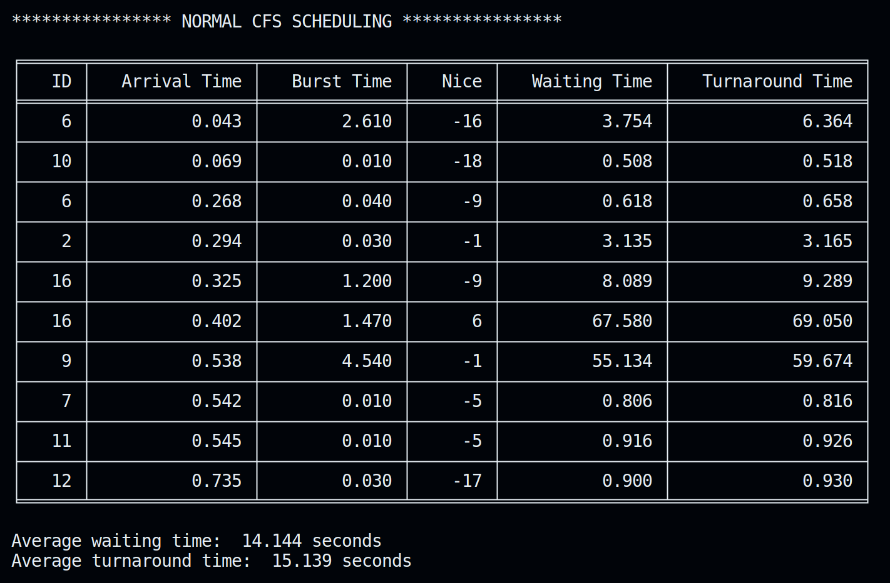
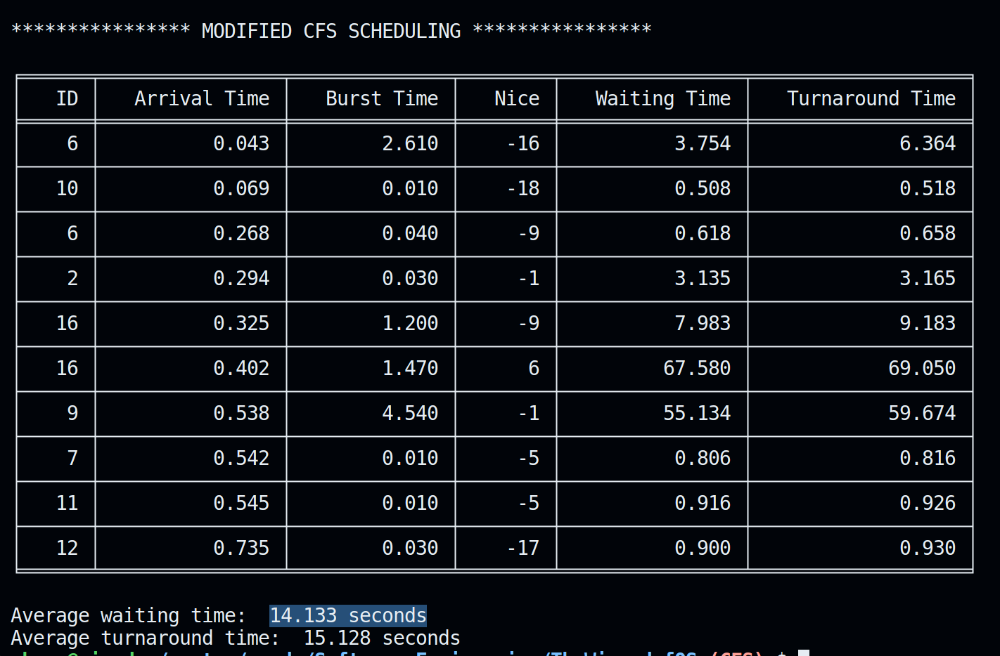

# The Wizard Of OS

### An ML engine for the Linux process scheduler

The motivation for this project came from our Ubuntu 22.04LTS crashing on various occassions of multiple vscode instance usages. This lead to discussion on a potential idea to work on this and this led us to walk the yellow road and landed us onto The Three Easy Pieces. From there, we decided to create something to ease the workload on our poor scheduler. 

We went through multiple research papers but most of them neither had credible results to show nor had any code as their proof of work. The approach we use here relies on the fact that processes that are about to be finished should be let finished. 

We present a CFS scheduling visualisation in python which uses the data from our ML engine to make decisions regarding making a context switch or not. We explored various ML algos based on their accuracy and overhead introduced including decision trees, random forests, xgboost. We settled on random forest because it gave the best accuracy in limited time.

Our algorithm gives an optimisation for nearly 90% of the randomized nice value processes that we use for testing. Here are the results : 

Here the algorithm is able to achieve an optimisation of nearly 0.011 seconds which scales well with large number of processes. 

# Contributors

Made with ❤️ by: 

1. [Shogo](https://twitter.com/ShogLoFi)
2. [Kowalski](https://twitter.com/AnantJain99390)
3. [4m4n-x-b4w4n3](https://twitter.com/Abnwamsn)
4. [Simp](https://github.com/atul-k-6)
